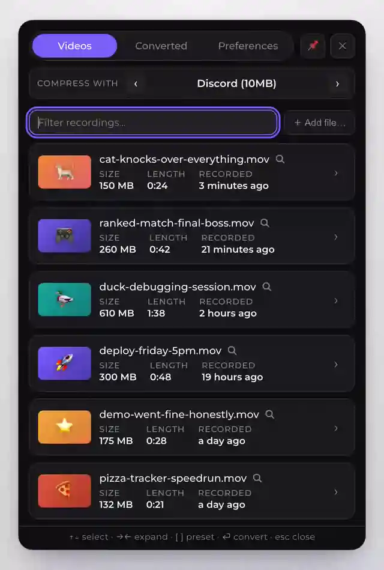
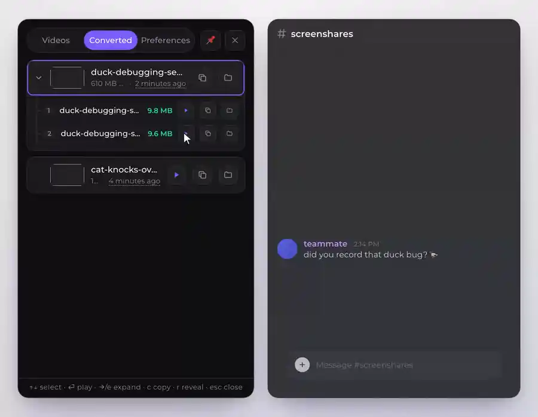

<p align="center">
  
</p>

<h1 align="center">Tamp</h1>

<p align="center">
  <strong>Shrink screen recordings to a target size, right from your menu bar.</strong>
</p>

<p align="center">
  <a href="https://github.com/ValeriyMaslenikov/tamp/releases/latest"></a>
  <a href="https://github.com/ValeriyMaslenikov/tamp/actions/workflows/ci.yml"></a>
  <a href="https://github.com/ValeriyMaslenikov/tamp/wiki"></a>
  <a href="LICENSE"></a>
</p>

---

You record your screen, and your OS hands you a 300 MB file that Discord (10 MB),
Slack, or your bug tracker refuses to accept. Tamp fixes that in one click:

1. **Click the Tamp icon** in your menu bar (system tray on Windows) — it lists
   your latest recordings.
2. **Click a video** — Tamp computes the exact bitrate to land *just under* your
   target size and encodes on the GPU. It never hands you a file over the target.
3. **Paste.** The compressed file is saved next to the original and (optionally)
   already on your clipboard, ready to drop into any chat.

Everything runs on your machine with a bundled FFmpeg — no uploads, no telemetry,
no account.

<p align="center">
  
</p>

<p align="center"><em>One click — pick a recording, watch it land just under your target.</em></p>

<details>
<summary>📎 <strong>Too long for one file? Split it, then paste every part into chat</strong></summary>

<br/>

<p align="center">
  
</p>

When a recording can't fit your target in one file, Tamp splits it into parts that
each land under the limit. **Copy all** puts every part on your clipboard, so you
paste them straight into Discord, Slack, or your bug tracker.

</details>

<details>
<summary>🪟 <strong>Drag &amp; drop a recording onto the panel</strong></summary>

<br/>

<p align="center">
  
</p>

Pin the panel open, then drag any recording in from Finder — Tamp compresses it
with your active preset the moment you drop it.

</details>

## 📖 Documentation

Full guides live in the **[Tamp Wiki](https://github.com/ValeriyMaslenikov/tamp/wiki)**:

- [**Installing Tamp**](https://github.com/ValeriyMaslenikov/tamp/wiki/Installing-Tamp) ·
  [**Getting Started**](https://github.com/ValeriyMaslenikov/tamp/wiki/Getting-Started)
- [**FAQ & Troubleshooting**](https://github.com/ValeriyMaslenikov/tamp/wiki/FAQ-and-Troubleshooting)

## Features

- 🎯 **Size-first presets** — say "fit under N MB" and Tamp computes the rest, with
  optional FPS caps, downscaling, and audio stripping. Ships with a *Discord (10 MB)*
  preset. → [Presets & Splitting](https://github.com/ValeriyMaslenikov/tamp/wiki/Presets-and-Splitting)
- 🎚️ **Two ways to pick a preset** — a quick-pick menu (default preselected, <kbd>1</kbd>–<kbd>9</kbd>
  for the rest) or a persistent active-preset bar you set once. → [Compressing Videos](https://github.com/ValeriyMaslenikov/tamp/wiki/Compressing-Videos)
- 🎞️ **Three output formats** — MP4 (H.264, hardware-accelerated), WebM (two-pass
  VP9 + Opus), and GIF (palette-optimized). → [How It Works](https://github.com/ValeriyMaslenikov/tamp/wiki/How-It-Works-and-Privacy#choosing-a-format)
- ✂️ **Split long clips** — turn one too-long recording into several parts that each
  fit your target, automatically or on your terms. → [Splitting](https://github.com/ValeriyMaslenikov/tamp/wiki/Presets-and-Splitting#splitting-into-parts)
- ⚡ **One click, zero imports** — Tamp watches your recording folders and reuses an
  existing output instantly instead of re-encoding. → [Compressing Videos](https://github.com/ValeriyMaslenikov/tamp/wiki/Compressing-Videos)
- ⌨️ **Keyboard-first** — global shortcuts compress your latest recording or toggle the
  panel; inside, type to filter and drive everything from the keyboard. → [Shortcuts](https://github.com/ValeriyMaslenikov/tamp/wiki/Preferences-and-Shortcuts#keyboard-shortcuts)
- 🔍 **Preview & custom one-offs** — expand any row for a montage preview, or run a
  one-off conversion with its own settings. → [Compressing Videos](https://github.com/ValeriyMaslenikov/tamp/wiki/Compressing-Videos#custom-one-off-conversion)
- 📋 **Clipboard-ready output** — the finished file is copied as a *file*, so <kbd>⌘V</kbd>
  attaches it directly in Discord/Slack. → [Output files](https://github.com/ValeriyMaslenikov/tamp/wiki/Converted-History-and-Output)
- 🗂️ **Durable history** — every conversion lands in the Converted tab with before/after
  sizes, play/copy/reveal, even after the original is gone. → [Converted History](https://github.com/ValeriyMaslenikov/tamp/wiki/Converted-History-and-Output)
- 🗑️ **Reclaim disk space** — optionally move the bulky original to the Trash after a
  successful compress. → [Behavior](https://github.com/ValeriyMaslenikov/tamp/wiki/Preferences-and-Shortcuts#behavior)
- 🔒 **Local and private** — bundled static FFmpeg, no uploads, no telemetry, no account.
  → [Privacy](https://github.com/ValeriyMaslenikov/tamp/wiki/How-It-Works-and-Privacy#privacy--your-data)

## Install

**Windows** — grab `Tamp_<version>_x64-setup.exe` (or `_arm64-setup.exe`) from
[**Releases**](https://github.com/ValeriyMaslenikov/tamp/releases/latest) and run it
(per-user, no admin). The Windows build isn't code-signed yet, so SmartScreen may
warn — click **More info → Run anyway**.

**macOS (Apple Silicon)** — grab the `.dmg`, drag **Tamp** to Applications, and
open it. The macOS build is **signed with a Developer ID and notarized by Apple**,
so it launches with no Gatekeeper warning.

Full steps, first-run details, Intel Macs, and building from source:
**[Installing Tamp](https://github.com/ValeriyMaslenikov/tamp/wiki/Installing-Tamp)**.

## Development

```bash
bun tauri dev        # run the app with hot reload
bun run test         # frontend unit tests (vitest)
bunx playwright test # frontend UI E2E
cd src-tauri && cargo test   # Rust unit + integration tests
```

See [AGENTS.md](AGENTS.md) for the project layout and architecture rules, and
[CONTRIBUTING.md](CONTRIBUTING.md) for the full workflow and release process.

## Roadmap

- Linux (the platform layer is ready; needs a clipboard/tray strategy and CI target)
- Windows code signing (macOS builds are already signed + notarized)

## License

[MIT](LICENSE) © Valerii Maslenykov.

The installers bundle GPL-licensed static FFmpeg binaries built by
[martin-riedl.de](https://ffmpeg.martin-riedl.de/) (macOS) and
[BtbN/FFmpeg-Builds](https://github.com/BtbN/FFmpeg-Builds) (Windows); FFmpeg is a
trademark of Fabrice Bellard. Tamp invokes these binaries as separate processes.
