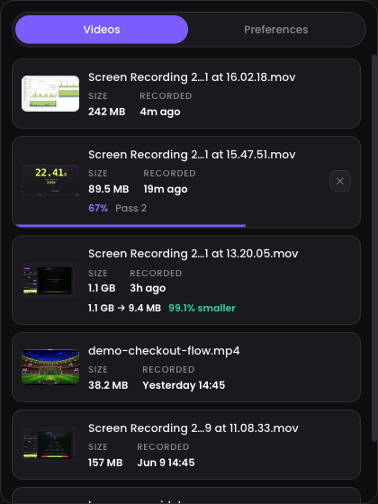
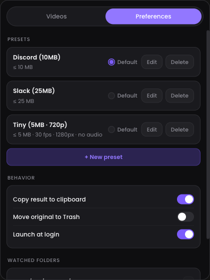

<p align="center">
  
</p>

<h1 align="center">tamp</h1>

<p align="center">
  <strong>Shrink screen recordings to a target size, right from your menu bar.</strong>
</p>

<p align="center">
  <a href="https://github.com/ValeriyMaslenikov/tamp/releases/latest"></a>
  <a href="https://github.com/ValeriyMaslenikov/tamp/actions/workflows/ci.yml"></a>
  <a href="LICENSE"></a>
</p>

---

You record your screen with <kbd>⌘⇧5</kbd>, and macOS hands you a 300 MB `.mov` that
Discord (10 MB), Slack, or your bug tracker refuses to accept. tamp fixes that in one click:

1. **Click the tamp icon** in your menu bar — it lists your latest recordings.
2. **Click a video** — tamp runs a two-pass H.264 encode calculated to land *just under*
   your target size (say, 10 MB), no codec knowledge required.
3. **Paste.** The compressed file is saved next to the original and (optionally) already
   on your clipboard, ready to drop into any chat.

<p align="center">
  
</p>

## Features

- 🎯 **Size-first presets** — "fit under N MB" is the primary control, with optional FPS caps
  and downscaling. Ships with a *Discord (10 MB)* preset; add your own for Slack, email, etc.
- ⚡ **One click, zero imports** — tamp watches your recording folders (Desktop by default).
  No drag & drop, no open dialogs. Click a row and it's encoding.
- 📊 **Progress in the menu bar** — a live percentage next to the tray icon; queue more
  videos while one is encoding.
- 🖱️ **Hover preview** — with multiple presets, hovering a row plays a muted 2× preview
  and lets you pick a preset for that specific video.
- 📋 **Clipboard-ready output** — the finished file is copied as a *file* (not a path),
  so ⌘V attaches it directly in Discord/Slack.
- 🗑️ **Reclaim disk space** — optionally move the bulky original to the Trash (recoverable)
  after a successful compress.
- 🔒 **Local and private** — everything runs on your machine with a bundled static FFmpeg.
  No uploads, no telemetry, no account.

## Install

### Download (Apple Silicon)

1. Grab the latest `.dmg` from [**Releases**](https://github.com/ValeriyMaslenikov/tamp/releases/latest).
2. Open it and drag **tamp** into **Applications**.
3. First launch: tamp is ad-hoc signed (no Apple Developer certificate), so macOS will warn you.
   Either **right-click the app → Open → Open**, or run:
   ```bash
   xattr -dr com.apple.quarantine /Applications/tamp.app
   ```
4. Look for the compress-arrows icon in your menu bar. There's no Dock icon — tamp lives
   entirely in the menu bar.

On first use macOS will ask for permission to access your Desktop — that's tamp reading
your screen recordings.

> **Intel Macs:** not prebuilt yet, but `./scripts/fetch-ffmpeg.sh x86_64` + `bun tauri build`
> produces a working Intel binary. See [Build from source](#build-from-source).

### Build from source

```bash
git clone https://github.com/ValeriyMaslenikov/tamp.git && cd tamp
bun install
./scripts/fetch-ffmpeg.sh        # fetch static FFmpeg/ffprobe sidecars
bun tauri build                  # → src-tauri/target/release/bundle/{macos,dmg}
```

Requires [Bun](https://bun.sh) and [Rust](https://rustup.rs).

## Usage notes

- **Default preset on click** — clicking a video row immediately compresses with the
  default preset (★ in Preferences). Hover the row to pick a different preset per video.
- **Presets** — each preset sets a max file size, and optionally: cap FPS, limit width
  (or scale by percentage), strip audio. tamp computes the bitrate from the video's
  duration to hit the size, with a small safety margin.
- **Output** — saved as `<name> (tamped).mp4` next to the original. tamp's own outputs
  never show up in the recordings list.
- **Watched folders** — Preferences → Watched folders. Desktop is the default; add
  wherever your recorder saves.

  
- **"Target too small"** — a long video may not fit the target even at minimum quality;
  tamp tells you instead of producing unwatchable output. Lower the FPS / resolution in
  the preset or pick a larger target.

## How it works

tamp bundles a static [FFmpeg](https://ffmpeg.org) and runs a classic two-pass
H.264 encode: video bitrate = (target size − audio budget) ÷ duration, minus a ~5%
container margin, `aac 96k` audio, `+faststart` for instant remote playback. If the
result still overshoots (rare), it re-encodes once with a corrected bitrate.
The panel is a [Tauri 2](https://tauri.app) webview; the engine, folder scanning, and
clipboard integration are Rust.

## Development

```bash
bun tauri dev        # run the app with hot reload
bun run test         # frontend unit tests (vitest)
cd src-tauri && cargo test   # Rust unit + integration tests
```

See [CONTRIBUTING.md](CONTRIBUTING.md) for the full workflow and release process.

## Roadmap

- Drag & drop videos onto the panel for quick one-off compression
- Windows & Linux (the architecture is cross-platform; platform shims are isolated)
- Notarized builds

## License

[MIT](LICENSE) © Valerii Maslenykov.

The DMG bundles GPL-licensed static FFmpeg binaries built by
[martin-riedl.de](https://ffmpeg.martin-riedl.de/); FFmpeg is a trademark of
Fabrice Bellard. tamp invokes these binaries as separate processes.
