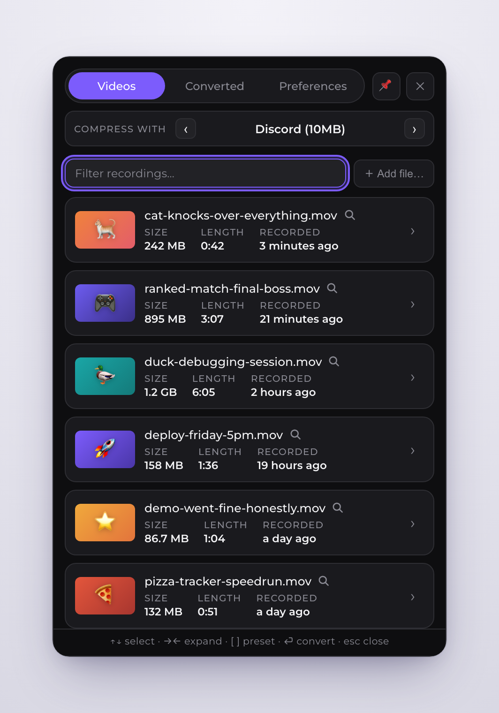
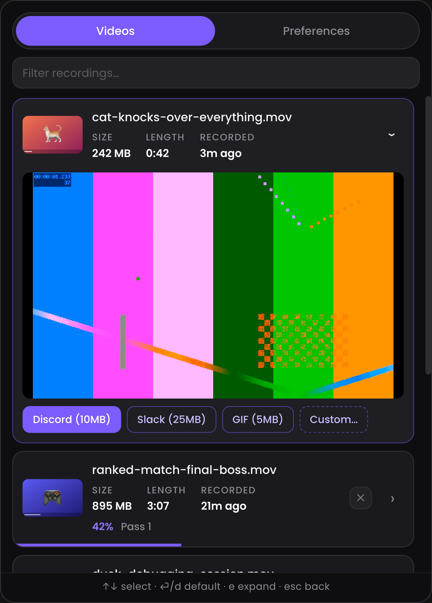
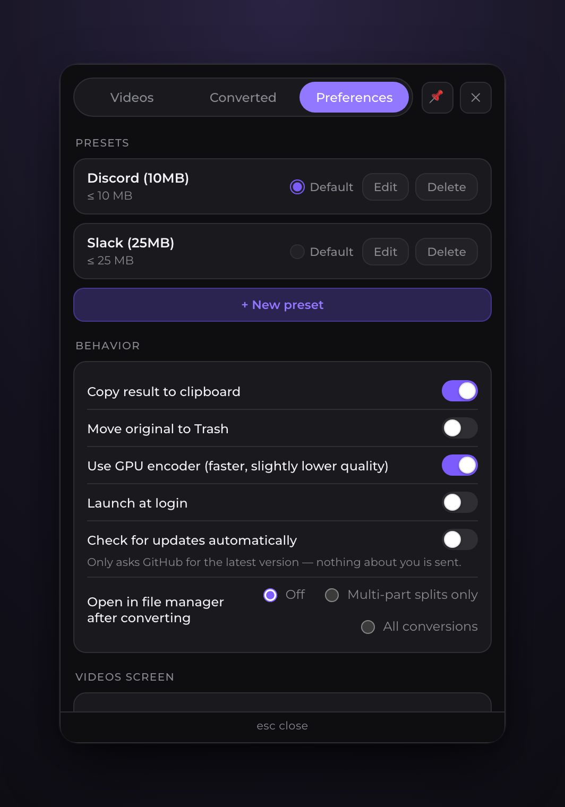

<p align="center">
  
</p>

<h1 align="center">tamp</h1>

<p align="center">
  <strong>Shrink screen recordings to a target size, right from your menu bar.</strong>
</p>

<p align="center">
  <a href="https://github.com/ValeriyMaslenikov/tamp/releases/latest"></a>
  <a href="https://github.com/ValeriyMaslenikov/tamp/actions/workflows/ci.yml"></a>
  <a href="LICENSE"></a>
</p>

---

You record your screen with <kbd>⌘⇧5</kbd>, and macOS hands you a 300 MB `.mov` that
Discord (10 MB), Slack, or your bug tracker refuses to accept. tamp fixes that in one click:

1. **Click the tamp icon** in your menu bar — it lists your latest recordings.
2. **Click a video** — tamp computes the exact bitrate to land *just under* your target
   size (say, 10 MB) and encodes on the GPU, no codec knowledge required. It will never
   hand you a file over the target.
3. **Paste.** The compressed file is saved next to the original and (optionally) already
   on your clipboard, ready to drop into any chat.

<p align="center">
  
</p>

## Features

- 🎯 **Size-first presets** — "fit under N MB" is the primary control, with optional FPS caps,
  downscaling, and audio stripping. Ships with a *Discord (10 MB)* preset; add your own for
  Slack, email, etc.
- 🎞️ **Three output formats** — MP4 (H.264, hardware-accelerated via VideoToolbox), WebM
  (two-pass VP9 + Opus) for the web, and GIF (palette-optimized, size-targeted) for the
  messengers that still insist on it.
- ⚡ **One click, zero imports** — tamp watches your recording folders (Desktop by default).
  Click a row and it's encoding; click again later and tamp *reuses* the existing output
  instantly instead of re-encoding (outputs carry a tiny config fingerprint in the name).
- ⌨️ **Keyboard-first** — a global shortcut (<kbd>⌘⌥T</kbd>) compresses your latest recording
  without even opening the panel; <kbd>⌘⌥O</kbd> toggles the panel; inside, type to filter,
  arrows select, <kbd>⏎</kbd>/<kbd>d</kbd> run the default preset, <kbd>e</kbd> expands,
  <kbd>esc</kbd> backs out.
- 🔍 **Preview before you commit** — expand any row for a generated mini-montage preview
  (TikTok-style cuts, instant even for gigabyte files), pick a preset, or run a one-off
  **Custom conversion** with its own size/fps/scale/format.

  
- 📊 **Progress in the menu bar** — a live percentage next to the tray icon; queue more
  videos while one is encoding.
- 📋 **Clipboard-ready output** — the finished file is copied as a *file* (not a path),
  so ⌘V attaches it directly in Discord/Slack.
- 🗑️ **Reclaim disk space** — optionally move the bulky original to the Trash (recoverable)
  after a successful compress. Deleted the original? The compressed copy stays in the list
  with its before/after sizes.
- 🧭 **Built to be debugged** — reveal any video in Finder from its row; rotating logs
  (10 MB cap) capture every ffmpeg command line and error: right-click the menu bar
  icon → *Open Logs*. The app version sits at the bottom of Preferences.
- 🔒 **Local and private** — everything runs on your machine with a bundled static FFmpeg.
  No uploads, no telemetry, no account.

## Install

### Download (Apple Silicon)

1. Grab the latest `.dmg` from [**Releases**](https://github.com/ValeriyMaslenikov/tamp/releases/latest).
2. Open it and drag **tamp** into **Applications**.
3. First launch: tamp is ad-hoc signed (no Apple Developer certificate), so macOS will warn you.
   Either **right-click the app → Open → Open**, or run:
   ```bash
   xattr -dr com.apple.quarantine /Applications/tamp.app
   ```
4. Look for the compress-arrows icon in your menu bar. There's no Dock icon — tamp lives
   entirely in the menu bar.

On first use macOS will ask for permission to access your Desktop — that's tamp reading
your screen recordings.

> **Intel Macs:** not prebuilt yet, but `bun scripts/fetch-ffmpeg.ts x64` + `bun tauri build`
> produces a working Intel binary. See [Build from source](#build-from-source).

### Build from source

```bash
git clone https://github.com/ValeriyMaslenikov/tamp.git && cd tamp
bun install
bun scripts/fetch-ffmpeg.ts      # fetch static FFmpeg/ffprobe sidecars
bun tauri build                  # → src-tauri/target/release/bundle/{macos,dmg}
```

Requires [Bun](https://bun.sh) and [Rust](https://rustup.rs).

## Usage notes

- **Default preset on click** — clicking a video row immediately compresses with the
  default preset (★ in Preferences). The chevron (or <kbd>e</kbd>) expands the row for a
  preview, per-video preset choice, or a custom one-off conversion.
- **Presets** — each preset sets a max file size, an output format (MP4/WebM/GIF), and
  optionally: cap FPS, limit width (or scale by percentage), strip audio. tamp computes
  the bitrate from the video's duration to hit the size, with a small safety margin —
  and never exceeds the source's own bitrate, so files don't grow.
- **Global shortcuts** — <kbd>⌘⌥T</kbd> compresses the newest recording with the default
  preset and puts the result on your clipboard (a notification warns if the latest
  recording is older than 10 minutes — both configurable); <kbd>⌘⌥O</kbd> opens the panel.
- **Output** — saved as `<name> (tamped 823f).mp4` next to the original (the 4 characters
  fingerprint the preset's settings, so each config keeps exactly one output and re-clicks
  reuse it). tamp's own outputs never show up in the recordings list while their original
  exists.
- **One preset per video with Trash enabled** — when "Move original to Trash" is on, the
  original is gone after the first conversion, so tamp blocks a second preset on the same
  video instead of failing halfway. Turn the toggle off to export several formats.
- **Watched folders** — Preferences → Watched folders. Desktop is the default; add
  wherever your recorder saves.

  
- **"Target too small"** — a long video may not fit the target even at minimum quality;
  tamp tells you instead of producing unwatchable output. Lower the FPS / resolution in
  the preset or pick a larger target.

## How it works

tamp bundles a static [FFmpeg](https://ffmpeg.org). The bitrate is computed from the
target: video bitrate = (target size − audio budget) ÷ duration, minus a ~5% container
margin, `aac 96k` audio, `+faststart` for instant remote playback. When the target
would starve that bitrate (think a 4K screen recording into 10 MB), tamp automatically
caps the frame rate at 30 fps and steps the resolution down just enough to keep the
result legible — at which point Apple's hardware encoder (VideoToolbox) hits the size
reliably and fast. If a result ever overshoots, tamp converges with corrected re-encodes
(switching to precise two-pass software x264 when needed) and **never delivers a file
over the target** — if a target is truly unreachable it tells you instead.
The panel is a [Tauri 2](https://tauri.app) webview; the engine, folder scanning, and
clipboard integration are Rust.

## Development

```bash
bun tauri dev        # run the app with hot reload
bun run test         # frontend unit tests (vitest)
cd src-tauri && cargo test   # Rust unit + integration tests
```

See [CONTRIBUTING.md](CONTRIBUTING.md) for the full workflow and release process.

## Roadmap

- Drag & drop videos onto the panel for quick one-off compression
- Windows & Linux (the architecture is cross-platform; platform shims are isolated)
- Notarized builds

## License

[MIT](LICENSE) © Valerii Maslenykov.

The DMG bundles GPL-licensed static FFmpeg binaries built by
[martin-riedl.de](https://ffmpeg.martin-riedl.de/); FFmpeg is a trademark of
Fabrice Bellard. tamp invokes these binaries as separate processes.
