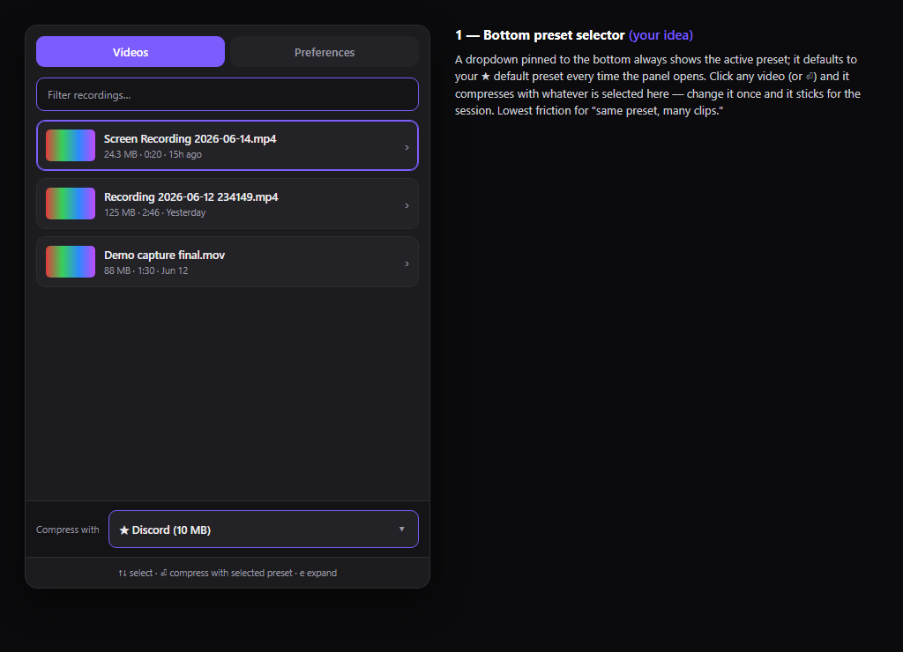
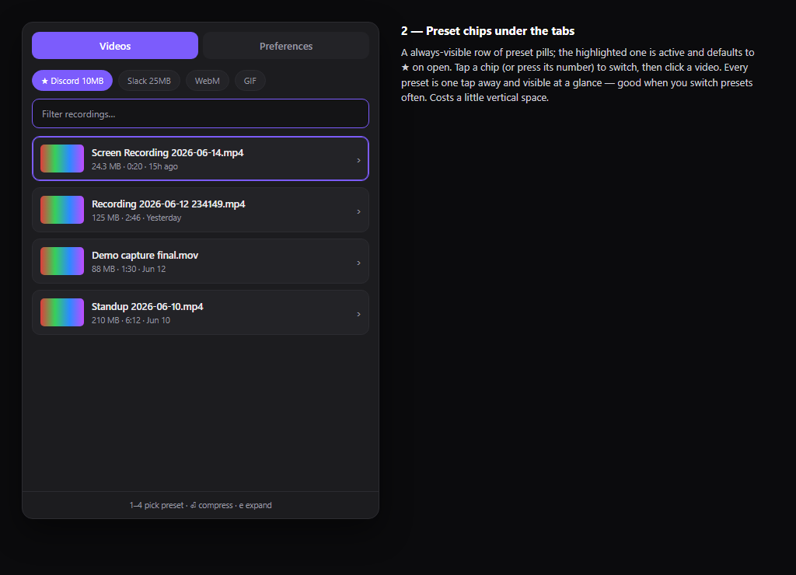
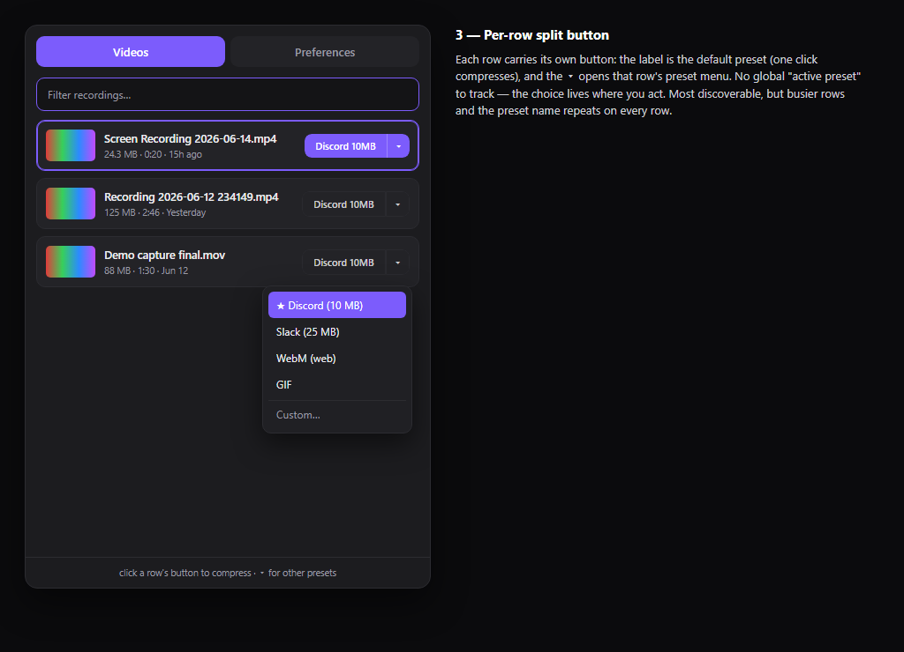
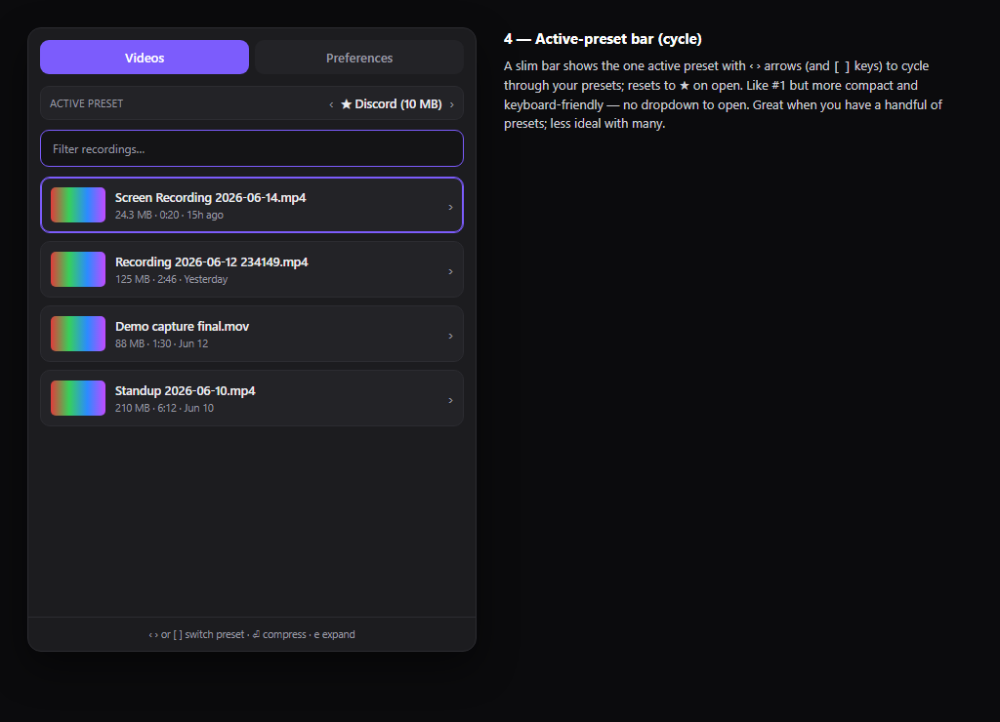
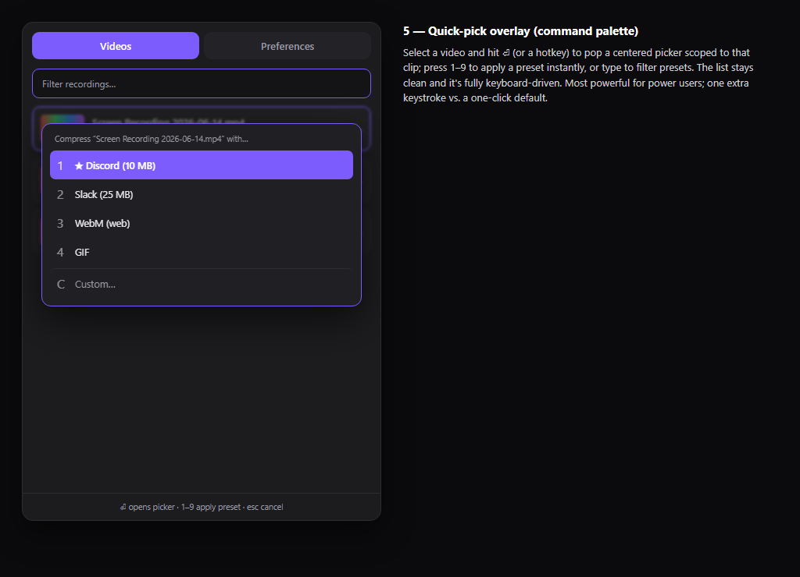

# Faster preset selection on the Videos screen — mockups

Five approaches to picking which preset compresses a video, without opening a
row's expanded view each time. Open the `.html` files in a browser to see them
live, or look at the screenshots below. These are throwaway visual mockups, not
production code.

Across all five, the **default preset (★) is pre-selected whenever the panel
opens** — so the common "just compress with my default" path stays one action.

| # | Approach | Best for | Trade-off |
|---|----------|----------|-----------|
| 1 | **Bottom preset selector** *(your idea)* | Same preset across many clips | A persistent dropdown takes a sliver of bottom space |
| 2 | **Preset chips under the tabs** | Frequently switching presets | Uses a row of vertical space; many presets overflow |
| 3 | **Per-row split button** | Discoverability; mixed presets per clip | Busiest rows; preset name repeats on every row |
| 4 | **Active-preset bar (cycle)** | A handful of presets, keyboard users | Cycling is slow with many presets |
| 5 | **Quick-pick overlay (palette)** | Power users, fully keyboard-driven | One extra keystroke vs. a one-click default |

## 1 — Bottom preset selector (your idea)
A dropdown pinned to the bottom always shows the active preset, defaulting to ★
on open. Click a video (or ⏎) → compresses with whatever is selected.

## 2 — Preset chips under the tabs
An always-visible row of preset pills; the highlighted one is active. Tap a chip
or press its number, then click a video.

## 3 — Per-row split button
Each row has its own button: label = default (one click compresses), ▾ opens
that row's preset menu. No global "active preset" to track.

## 4 — Active-preset bar (cycle)
A slim bar shows the one active preset with ‹ › arrows (and `[` `]` keys) to
cycle presets; resets to ★ on open. Compact, keyboard-friendly.

## 5 — Quick-pick overlay (command palette)
Select a video, hit ⏎ to pop a centered picker scoped to that clip; press 1–9 to
apply a preset instantly, or type to filter. Keeps the list clean.

